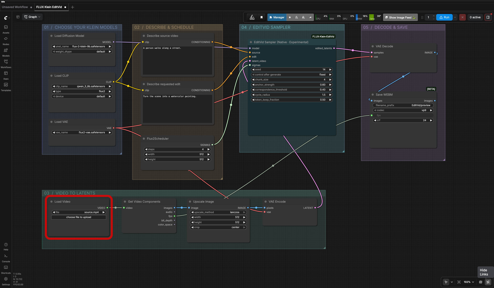
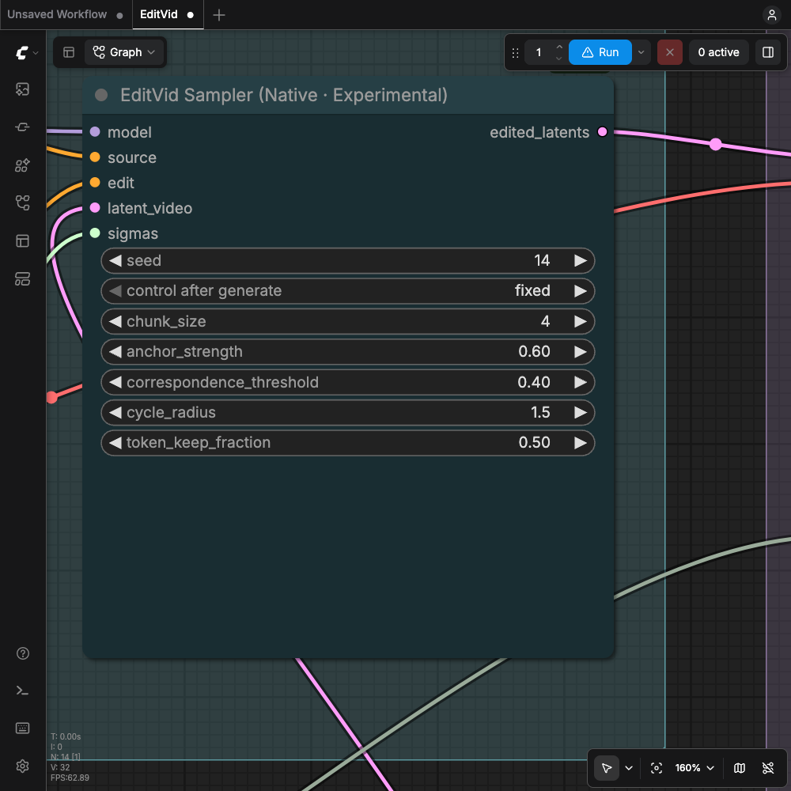

# ComfyUI FLUX Klein EditVid

**Native video editing with FLUX.2 Klein 9B by [Black Forest Labs](https://bfl.ai).** One sampler node for source
inversion, temporal attention and consistent editing across video frames.
Uses your existing ComfyUI model, text-encoder and VAE loaders. No Diffusers.


[Example workflow](examples/editvid_native.json)




## Install

1. Copy the **`ComfyUI-FLUX-Klein-EditVid` folder** into `ComfyUI/custom_nodes/`.
2. Restart ComfyUI.
3. Search for **EditVid Sampler** under `sampling/EditVid`.
4. Drag [`examples/editvid_native.json`](examples/editvid_native.json) onto the canvas.

```text
ComfyUI/
└── custom_nodes/
    └── ComfyUI-FLUX-Klein-EditVid/
        ├── __init__.py
        ├── nodes.py
        ├── core.py
        ├── temporal.py
        ├── README.md
        └── examples/
            └── editvid_native.json
```

## Required models

Use the files from a working **Klein 9B distilled** ComfyUI workflow:

| Loader | Model | ComfyUI folder |
|---|---|---|
| Load Diffusion Model | [FLUX.2 Klein 9B distilled](https://huggingface.co/black-forest-labs/FLUX.2-klein-9B) | `models/diffusion_models/` |
| Load CLIP | Matching Qwen3 8B text encoder; type **flux2** | `models/text_encoders/` |
| Load VAE | Matching FLUX.2 VAE | `models/vae/` |

The example's filenames are placeholders; select your actual files. This package
contains no model weights and does not download them. For the model itself, see
[Black Forest Labs](https://huggingface.co/black-forest-labs/FLUX.2-klein-9B).
Model access and model licenses are separate from this node's code license.

Use the distilled 9B model, not 4B, base or the dedicated KV model variant.
Base and distilled checkpoints can share architecture, so the node cannot
reliably identify the wrong variant from tensor shapes alone. FP8 and GGUF
loaders, LoRAs and additional model patches still require separate testing.

## First run

1. Select the three model files and a **short 4–8 frame video clip** in the loaders.
2. In **Describe source video**, describe what is currently in the clip.
3. In **Describe requested edit**, write the change you want.
4. Start with **4 steps**, **512 × 512** and **chunk size 4**.
5. Run the graph. The output is written under `ComfyUI/output/EditVid/`.

| Input | Example |
|---|---|
| Source | A person walks along a street. |
| Edit | Turn the scene into a watercolor painting. |

The example center-crops to 512 × 512 and processes **all frames** of the selected
clip. Chunk size limits frames processed together; it does not limit video length.
When changing resolution, update both **Upscale Image** and **Flux2Scheduler** to
the same dimensions. Prefer dimensions divisible by 16.

The included WEBM output preserves the input FPS but is silent. For source audio,
connect the decoded images, source audio and FPS to your usual video-composition
nodes instead. Original videos and generated results are not bundled.

## Node inputs



| Input | Purpose |
|---|---|
| `model` | Klein 9B from a standard Comfy model loader |
| `source` | Plain text conditioning describing the source video |
| `edit` | Plain text conditioning describing the requested change |
| `latent_video` | Ordered frame batch encoded with the Klein VAE |
| `sigmas` | Full descending schedule from 1 to 0, normally Flux2Scheduler |

The output is a standard **LATENT** batch. Connect it to VAE Decode.

| Setting | Default | Effect |
|---|---:|---|
| `seed` | 14 | Reproducible selection of correspondence tokens |
| `chunk_size` | 4 | Frames processed together; reduce if memory is exhausted |
| `anchor_strength` | 0.6 | Blending towards the source trajectory; 0 disables it |
| `correspondence_threshold` | 0.4 | Minimum feature similarity for token transfer |
| `cycle_radius` | 1.5 | Allowed round-trip mismatch, in latent token positions |
| `token_keep_fraction` | 0.5 | Fraction of valid token matches retained; 0 disables transfer |

CFG is fixed at 1 for the distilled workflow. Inversion determines the starting
latent; the seed does not add fresh random noise. Changing chunk size can change
the result. Each inversion step uses two model evaluations; each editing step
uses one, so four steps do not mean only four model evaluations.

## Compatibility and limitations

- Recent ComfyUI with Klein support and Flux attention/block patch hooks.
- Plain source/edit prompts and a constant frame resolution.
- No external subject-reference image, regional prompting, ControlNet or noise masks.
- CPU caches preserve temporal state between chunks. Input/output frames and
  inversion trajectories also use system RAM; this is not a streaming video decoder.
- No automatic OOM retry. Reduce resolution or chunk size and rerun.
- No validated minimum VRAM requirement or claimed upstream visual parity yet.

## Validation

Development checks passed: eight numerical tests and native ComfyUI integration
tests with small random models covering inversion, attention, chunk state,
cancellation and sampler reuse. These development test scripts are not included
in this repository. CPU integration reference:
`7193f5627f036701e5efc23beaea20fa37ceaadd`.

An end-to-end GPU test also completed with Klein 9B distilled on an NVIDIA B200
using ComfyUI 0.32.0: 8 frames, 512 × 512, 4 steps and chunk size 4. The requested
edit changed fire to blue and produced a WEBM video. This short test does not
establish long-video consistency or performance on consumer GPUs.

## Troubleshooting

| Problem | What to check |
|---|---|
| Node missing or `IMPORT FAILED` | Confirm the folder layout, restart ComfyUI and inspect its startup log. Update ComfyUI if Flux patch hooks are missing. |
| Model filename rejected | Choose installed files in the loaders; example names are placeholders. |
| “Klein 9B distilled only” | Use the supported 9B architecture and correct distilled checkpoint. |
| Expected 128 latent channels | Use the matching Klein/Flux2 VAE. |
| Sigma schedule error | Connect a full Flux2Scheduler output, from 1 to 0. |
| Out of memory | Lower chunk size to 2 or 1 and/or lower the frame resolution. |
| Poor edit or flicker | Check the source description, edit instruction and model variant. Quality is still experimental. |
| Video has no audio | The example Save WEBM node writes frames only; use an audio-capable output workflow. |

When reporting an issue, include the error log, ComfyUI version, GPU/VRAM, model
filenames, resolution, frame count, chunk size and a workflow with private prompts
or file paths removed as needed.

## Credits and license

Based on [PLAN-Lab/EditVid](https://github.com/PLAN-Lab/EditVid),
*One Editor, Many Edits: A Unified Training-Free Framework for Diverse Video Editing*.
This is an independent ComfyUI adaptation, not an official PLAN-Lab release.

FLUX.2 Klein is developed by [Black Forest Labs](https://bfl.ai).

Code: [Apache-2.0](LICENSE). Adapted from EditVid revision `ba40bed`.
Native ComfyUI integration, tiled correspondence search and deterministic token
selection differ from upstream.
